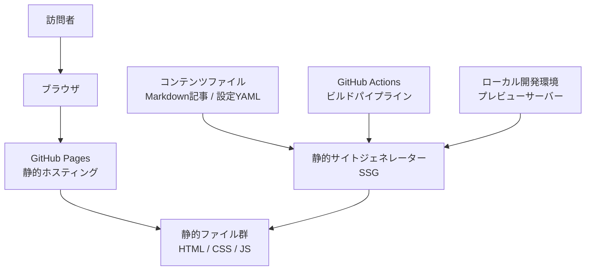
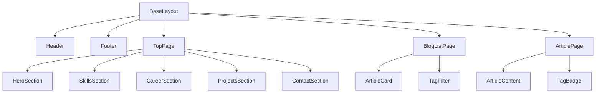
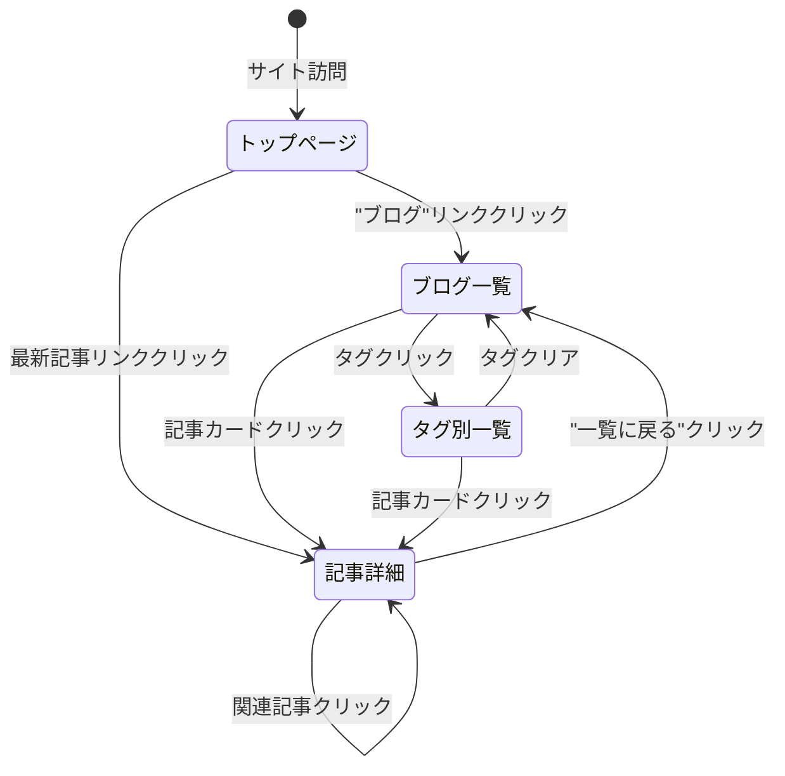
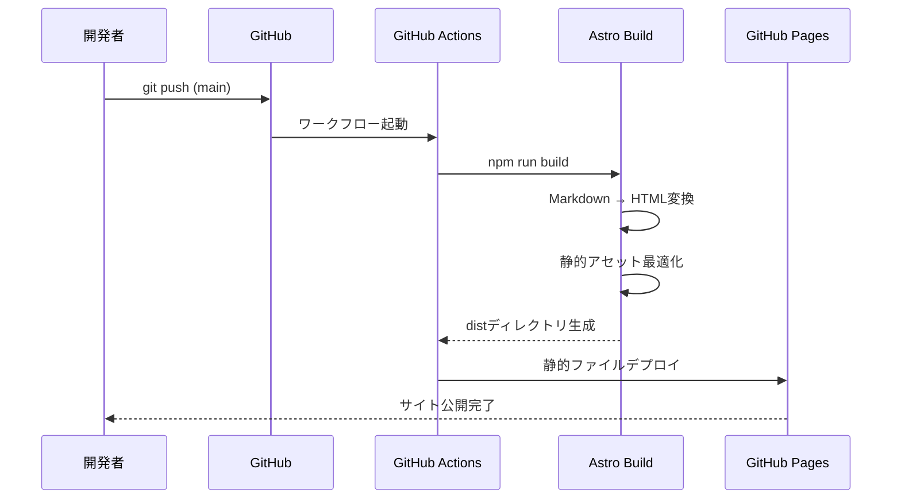
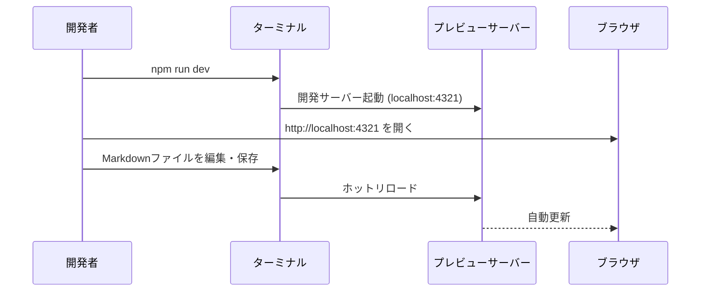

# 機能設計書 (Functional Design Document)

## システム構成図



## 技術スタック

| 分類 | 技術 | 選定理由 |
|------|------|----------|
| 静的サイトジェネレーター | Astro | コンポーネント指向・Markdown対応・高パフォーマンス |
| スタイリング | Tailwind CSS | ユーティリティファーストで高速なUI開発 |
| コンテンツ管理 | Markdownファイル | Gitで管理・Pushで更新・エディタ不要 |
| ホスティング | GitHub Pages | 無料・カスタムドメイン対応 |
| CI/CD | GitHub Actions | Push時に自動ビルド・デプロイ |
| シンタックスハイライト | Shiki (Astro組込) | 多言語対応・ゼロJS |

## データモデル定義

### エンティティ: Article (技術記事)

```typescript
interface Article {
  // slug はフロントマターに定義しない。ファイル名 (拡張子を除く) から Astro が自動生成する
  // 例: go-concurrency-tips.md → slug: "go-concurrency-tips"
  title: string;          // 記事タイトル (1-100文字)
  description: string;    // 記事の概要 (1-200文字)
  publishedAt: Date;      // 公開日
  updatedAt?: Date;       // 最終更新日
  tags: string[];         // タグ一覧 (例: ["Go", "バックエンド"])
  draft: boolean;         // trueの場合は非公開
  body: string;           // 本文 (Markdown)
}
```

**制約**:
- `slug` はファイル名から自動導出。ファイル名は英数字・ハイフンのみ使用すること
- `tags` は1〜10件
- `draft: true` の記事はビルド時に除外される

---

### エンティティ: Skill (スキル)

```typescript
interface Skill {
  name: string;           // スキル名 (例: "Go", "PostgreSQL")
  category: SkillCategory; // カテゴリ
  level: SkillLevel;      // 習熟度
  yearsOfExperience: number; // 経験年数
  featured: boolean;      // トップページに表示するか
}

type SkillCategory =
  | 'language'      // プログラミング言語
  | 'framework'     // フレームワーク
  | 'database'      // データベース
  | 'infrastructure' // インフラ・クラウド
  | 'tool';         // ツール・その他

type SkillLevel =
  | 'expert'        // 実務で深く使用・チームへの技術指導が可能
  | 'proficient'    // 実務で継続的に使用・一人で完結できる
  | 'familiar';     // 実務経験あり・補助的に使用
```

---

### エンティティ: CareerHistory (職務経歴)

```typescript
interface CareerHistory {
  id: string;             // 識別子
  company: string;        // 会社名
  role: string;           // 職種・役職 (例: "バックエンドエンジニア")
  startDate: string;      // 開始年月 (例: "2018-04")
  endDate?: string;       // 終了年月 (現職の場合は省略)
  description: string;    // 担当業務の概要
  achievements: string[]; // 主な実績・成果
  technologies: string[]; // 使用技術
}
```

---

### エンティティ: Project (制作物)

```typescript
interface Project {
  id: string;             // 識別子
  name: string;           // プロジェクト名
  description: string;    // 概要 (1-300文字)
  technologies: string[]; // 使用技術
  githubUrl?: string;     // GitHubリポジトリURL
  liveUrl?: string;       // デモ・本番URL
  imageUrl?: string;      // スクリーンショット画像パス
  featured: boolean;      // トップページに表示するか
}
```

## コンテンツファイル構造

```
src/
├── content/
│   ├── articles/           # 技術記事 (Markdown)
│   │   ├── go-tips.md
│   │   └── postgres-index.md
│   └── config.ts           # コンテンツコレクション定義
├── data/
│   ├── skills.ts           # スキル一覧データ
│   ├── career.ts           # 職務経歴データ
│   └── projects.ts         # 制作物データ
```

**記事Markdownのフロントマター例**:
```markdown
---
title: "GoのgoroutineとChannelを使った並行処理パターン"
description: "実務で役立つGoの並行処理パターンを具体例とともに解説します"
publishedAt: 2026-04-01
tags: ["Go", "バックエンド", "並行処理"]
draft: false
---

本文をここに書く...
```

## コンポーネント設計

### ページ一覧

| ページ | パス | 説明 |
|--------|------|------|
| トップページ | `/` | ヒーロー・スキル・経歴・プロジェクト・コンタクトを1ページに集約 |
| ブログ一覧 | `/blog` | 記事一覧（タグフィルタ付き） |
| 記事詳細 | `/blog/[slug]` | 個別記事ページ |
| タグ別一覧 | `/blog/tags/[tag]` | タグでフィルタリングされた記事一覧 |

---

### コンポーネント構成



---

### HeroSection

**責務**:
- 名前・職種・キャッチコピーをファーストビューで表示
- SNS・GitHubへのリンクを表示

**表示項目**:
- 名前（大見出し）
- 職種（例: Backend Engineer）
- 短い自己紹介文（2〜3文）
- GitHubリンク・SNSリンク（アイコンボタン）

---

### SkillsSection

**責務**:
- スキルをカテゴリ別にグループ化して表示
- `featured: true` のスキルを優先表示

**表示仕様**:
- カテゴリタブまたはグリッドレイアウト
- 各スキルに習熟度バッジ（expert / proficient / familiar）を表示

---

### CareerSection

**責務**:
- 職務経歴を時系列（新しい順）で表示
- 各経歴の業務概要・実績・使用技術を展開表示

**表示仕様**:
- タイムライン形式のレイアウト
- 期間・会社名・役職を一目で把握できる構成

---

### ProjectsSection

**責務**:
- `featured: true` のプロジェクトをカード形式で表示

**表示仕様**:
- カードグリッド（デスクトップ: 2〜3列、モバイル: 1列）
- 各カードにプロジェクト名・概要・技術タグ・GitHubリンクを表示

---

### ArticleCard

**責務**:
- ブログ一覧での記事プレビュー表示

**表示項目**:
- タイトル・投稿日・タグ一覧・概要文
- 記事詳細ページへのリンク

---

### TagFilter

**責務**:
- ブログ一覧ページでタグによる絞り込みナビゲーションを提供

**実装方式**: URLベースの静的ページ生成
- タグクリック → `/blog/tags/[tag]` へ遷移（JavaScript不要）
- Astroの `getStaticPaths()` で全タグ分のページを事前生成
- クライアントサイドJSを使わないため、ゼロJSポリシーを維持できる

**表示仕様**:
- 全タグをバッジ形式で一覧表示
- 現在選択中のタグをハイライト
- 「すべて表示」リンクで `/blog` に戻る

---

### ArticleContent

**責務**:
- Markdownで書かれた記事本文をHTMLとしてレンダリング
- コードブロックにシンタックスハイライトを適用

**仕様**:
- 見出し (h2/h3) に自動でアンカーリンクを付与
- コードブロックにコピーボタンを設置（後述のJS使用について参照）

**コピーボタンのJS使用について**:
コピーボタンはクライアントサイドJSが必要なため、Astroの Islands Architecture (`client:load` ディレクティブ) を使用する。コピーボタンのコンポーネントのみJSを読み込み、それ以外の記事本文はJSゼロで描画する。これはゼロJS原則の例外として明示的に許容する。

## 画面遷移図



## ビルド・デプロイフロー



**ローカル開発フロー**:



## UI設計

### レイアウト構造

**デスクトップ（1024px以上）**:
```
┌─────────────────────────────────────────┐
│ Header: ナビゲーション + 名前            │
├─────────────────────────────────────────┤
│ Hero: 名前・職種・自己紹介・SNSリンク    │
├─────────────────────────────────────────┤
│ Skills: カテゴリ別スキル一覧             │
├─────────────────────────────────────────┤
│ Career: タイムライン形式の職歴           │
├─────────────────────────────────────────┤
│ Projects: カードグリッド                │
├─────────────────────────────────────────┤
│ Contact: メール・SNSリンク              │
├─────────────────────────────────────────┤
│ Footer: コピーライト                    │
└─────────────────────────────────────────┘
```

**モバイル（768px未満）**:
- 全セクションが縦1列に積み重なる
- ナビゲーションはハンバーガーメニュー
- フォントサイズ・余白は自動調整

### タイポグラフィ

| 用途 | サイズ | ウェイト |
|------|--------|---------|
| ページタイトル (h1) | 2.5rem (40px) | Bold (700) |
| セクション見出し (h2) | 1.75rem (28px) | SemiBold (600) |
| 小見出し (h3) | 1.25rem (20px) | Medium (500) |
| 本文 | 1rem (16px) | Regular (400) |
| キャプション | 0.875rem (14px) | Regular (400) |

### カラーパレット

| 用途 | 色 |
|------|-----|
| プライマリー | 深みのある青 (#1E40AF) |
| テキスト | ほぼ黒 (#1F2937) |
| サブテキスト | グレー (#6B7280) |
| 背景 | 白 (#FFFFFF) |
| セクション背景 (奇数) | ライトグレー (#F9FAFB) |
| タグ背景 | ブルー薄 (#EFF6FF) |

## パフォーマンス最適化

- **画像最適化**: Astro の `<Image>` コンポーネントで WebP 変換・サイズ最適化
- **ゼロ JS (原則)**: インタラクションのないページはJSを一切出力しない
- **JS使用の例外**: コードブロックのコピーボタンのみ `client:load` で Island として実装する
- **フォント最適化**: Google Fontsは`font-display: swap`でCLS抑制
- **CSS最小化**: Tailwindのpurgeで未使用CSSを除去

## セキュリティ考慮事項

- **コンタクトフォーム**: Formspree等の外部サービスを利用し、メールアドレスをHTMLに直接記載しない
- **依存関係の脆弱性**: `npm audit` をCI/CDに組み込み、定期的に確認
- **HTTPS**: GitHub Pages の標準HTTPS機能を使用 (追加対応不要)

## エラーハンドリング

### ビルド時エラー

| エラー種別 | 処理 | 開発者への表示 |
|-----------|------|---------------|
| Markdownフロントマター不正 | ビルド失敗 | 該当ファイルとフィールド名を表示 |
| 画像ファイルが見つからない | ビルド失敗 | 参照パスを表示 |
| 型バリデーションエラー | ビルド失敗 | コレクション名とエラー内容を表示 |

### 閲覧時エラー

| エラー種別 | 処理 | 訪問者への表示 |
|-----------|------|---------------|
| 存在しないURL | カスタム404ページ表示 | 「ページが見つかりません」+ トップへ誘導 |
| 画像読み込み失敗 | alt テキスト表示 | 代替テキストで意味を保持 |

## テスト戦略

### ビルドテスト
- すべての記事が正常にビルドされること
- 型バリデーションが通ること (`astro check`)

### パフォーマンステスト
- Lighthouse CI をGitHub Actionsに組み込み
- パフォーマンス・アクセシビリティ・SEOのスコアを自動計測
- スコアが閾値(90点)を下回るとCI失敗

### リンクチェック
- 内部リンクの404をCI/CDで自動検出
